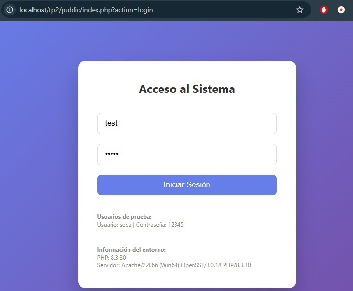
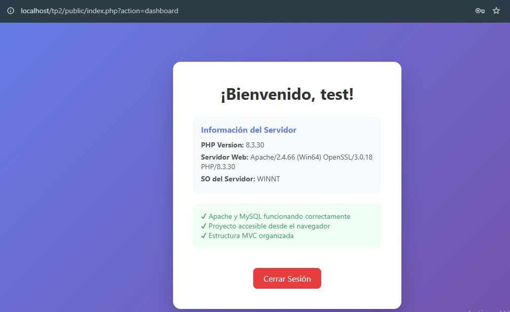

#  Entorno de Desarrollo Local con PHP y Laragon

[](https://github.com/MSebastianGutierrez/tp2-entornoLocal)
[](https://php.net)
[]()

##  Tabla de Contenidos

- [Descripción del Proyecto](#-descripción-del-proyecto)
- [Tecnologías Utilizadas](#-tecnologías-utilizadas)
- [Estructura del Proyecto](#-estructura-del-proyecto)
- [Instalación y Configuración](#-instalación-y-configuración)
- [Cómo Usar el Proyecto](#-cómo-usar-el-proyecto)
- [Capturas de Pantalla](#-capturas-de-pantalla)
- [Estado del Proyecto](#-estado-del-proyecto)

##  Descripción del Proyecto

Este proyecto es el resultado del Trabajo Práctico N°2 de la capacitación en **Desarrollo de Software**. El objetivo principal fue instalar y configurar un entorno de desarrollo web local profesional utilizando **Laragon**, y demostrar su correcto funcionamiento mediante una aplicación web simple con un sistema de autenticación de usuarios (login) y conexión a una base de datos **MySQL**.

La aplicación permite a los usuarios registrarse, iniciar sesión y acceder a un área privada (dashboard) donde se muestra información relevante del servidor y del entorno.

**Motivación:** Aprender a configurar un entorno de desarrollo local (LAMP/WAMP) de forma profesional, entender la interacción entre un servidor web (Apache), un gestor de base de datos (MySQL) y el lenguaje PHP, sentando las bases para el desarrollo de aplicaciones web más complejas en el futuro.

##  Tecnologías Utilizadas

*   **Servidor Local:** [Laragon](https://laragon.org/) (Apache/2.4.66, MySQL, PHP 8.3.30)
*   **Lenguaje:** [PHP 8.3.30](https://www.php.net/)
*   **Base de Datos:** [MySQL](https://www.mysql.com/)
*   **Editor de Código:** [Visual Studio Code](https://code.visualstudio.com/)
*   **Frontend:** HTML5, CSS3
*   **Control de Versiones:** [Git](https://git-scm.com/) & [GitHub](https://github.com/)

##  Estructura del Proyecto

El proyecto sigue una arquitectura **MVC (Modelo-Vista-Controlador)** básica para una clara separación de responsabilidades, lo que facilita su mantenimiento y escalabilidad.

```bash
tp2/
├── app/                       # Lógica de la aplicación
│   ├── controllers/           # Controladores (Reciben peticiones)
│   │   └── AuthController.php # Lógica de autenticación (login, logout)
│   ├── models/                # Modelos (Interactúan con la BD)
│   │   └── UserModel.php      # Consultas a la tabla 'usuarios'
│   ├── views/                 # Vistas (Interfaz de usuario)
│   │   ├── login.php          # Formulario de inicio de sesión
│   │   └── dashboard.php      # Área privada del usuario
│   └── config/                # Configuración
│       └── database.php       # Parámetros de conexión a MySQL
├── public/                    # Archivos públicos y punto de entrada
│   ├── css/                   # Hojas de estilo
│   │   └── style.css          # Estilos principales del sitio
│   └── index.php              # Front Controller (único punto de entrada)
└── README.md                  # Documentación del proyecto
```

##  Instalación y Configuración

Sigue estos pasos para tener una copia del proyecto funcionando en tu máquina local.

## Requisitos Previos

Tener Laragon (o XAMPP) instalado en tu sistema. Descargar Laragon

Asegurarse de que los servicios de Apache y MySQL estén en funcionamiento (íconos verdes en el panel de Laragon).

## Pasos de Instalación

Clonar el repositorio
Abre tu terminal y clona este proyecto dentro de la carpeta www de Laragon.

``` bash
git clone https://github.com/MSebastianGutierrez/tp2-entornoLocal C:\laragon\www\tp2
```

## Configurar la Base de Datos

Abre tu navegador y accede a http://localhost/phpmyadmin.

Crea una nueva base de datos llamada prueba_login.

Selecciona la base de datos prueba_login y ve a la pestaña "SQL".

Ejecuta el siguiente código SQL para crear la tabla e insertar un usuario de prueba:

```sql
CREATE TABLE `usuarios` (
  `id` int(11) NOT NULL AUTO_INCREMENT,
  `username` varchar(50) NOT NULL,
  `password` varchar(255) NOT NULL,
  PRIMARY KEY (`id`)
);

INSERT INTO `usuarios` (`username`, `password`) VALUES
('test', '12345');
```

##  Cómo Usar el Proyecto
Asegúrate de que Laragon esté corriendo (Apache y MySQL en verde).

Abre tu navegador web y navega a la siguiente URL:

text
http://localhost/tp2/public/index.php?action=login
Inicia Sesión con las siguientes credenciales de prueba:

Usuario: test

Contraseña: 12345

Al iniciar sesión correctamente, serás redirigido al dashboard, donde podrás ver información detallada del servidor y del entorno.

##  Capturas de Pantalla

| Pantalla login | Pantalla dashboard | 
|--------|----------|
|  |  |

## Estado del Proyecto

El proyecto cumple con todos los requisitos de la consigna. La instalación del entorno es correcta, los servicios funcionan y la aplicación web es accesible localmente, demostrando un entorno de desarrollo profesional y listo para su uso.